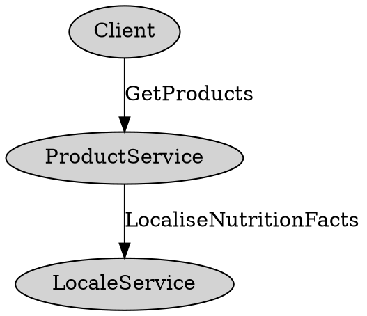

+++
title = "API Best Practices"
weight = 100
description = "A future-proof API is surprisingly hard to get right. The suggestions in this document make trade-offs to favor long-term, bug-free evolution."
type = "docs"
+++

Updated for proto3. Patches welcome!

This doc is a complement to
[Proto Best Practices](/programming-guides/dos-donts).
It's not a prescription for Java/C++/Go and other APIs.

If you see a proto straying from these guidelines in a code review, point the
author to this topic and help spread the word.

{}
These guidelines are just that and many have documented exceptions. For example,
if you're writing a performance-critical backend, you might want to sacrifice
flexibility or safety for speed. This
topic will help you better understand the trade-offs and make a decision that
works for your situation. {}

## Precisely, Concisely Document Most Fields and Messages {#precisely-concisely}

Chances are good your proto will be inherited and used by people who don't know
what you were thinking when you wrote or modified it. Document each field in
terms that will be useful to a new team-member or client with little knowledge
of your system.

Some concrete examples:

```proto
// Bad: Option to enable Foo
// Good: Configuration controlling the behavior of the Foo feature.
message FeatureFooConfig {
  // Bad: Sets whether the feature is enabled
  // Good: Required field indicating whether the Foo feature
  // is enabled for account_id.  Must be false if account_id's
  // FOO_OPTIN Gaia bit is not set.
  optional bool enabled;
}

// Bad: Foo object.
// Good: Client-facing representation of a Foo (what/foo) exposed in APIs.
message Foo {
  // Bad: Title of the foo.
  // Good: Indicates the user-supplied title of this Foo, with no
  // normalization or escaping.
  // An example title: "Picture of my cat in a box <3 <3 !!!"
  optional string title [(max_length) = 512];
}

// Bad: Foo config.
// Less-Bad: If the most useful comment is re-stating the name, better to omit
// the comment.
FooConfig foo_config = 3;
```

Document the constraints, expectations and interpretation of each field in as
few words as possible.

You can use custom proto annotations.
See [Custom Options](/programming-guides/proto2#options)
to define cross-language constants like `max_length` in the example above.
Supported in proto2 and proto3.

Over time, documentation of an interface can get longer and longer. The length
takes away from the clarity. When the documentation is genuinely unclear, fix it, but
look at it holistically and aim for brevity.

## Use Different Messages for Wire and Storage {#use-different-messages}

If a top-level proto you expose to clients is the same one you store on disk,
you're headed for trouble. More and more binaries will depend on your API over
time, making it harder to change. You'll want the freedom to change your storage
format without impacting your clients. Layer your code so that modules deal
either with client protos, storage protos, or translation.

Why? You might want to swap your underlying storage system. You might want to
normalize—or denormalize—data differently. You might realize that parts of your
client-exposed proto make sense to store in RAM while other parts make sense to
go on disk.

When it comes to protos nested one or more levels within a top-level request or
response, the case for separating storage and wire protos isn't as strong, and
depends on how closely you're willing to couple your clients to those protos.

There's a cost in maintaining the translation layer, but it quickly pays off
once you have clients and have to do your first storage changes.

You might be tempted to share protos and diverge "when you need to." With a
perceived high cost to diverge and no clear place to put internal fields, your
API will accrue fields clients either don't understand or begin to depend on
without your knowledge.

By starting with separate proto files, your team will know where to add internal
fields without polluting your API. In the early days, the wire proto can be
tag-for-tag identical with an automatic translation layer (think: byte copying
or proto reflection). Proto annotations can also power an automatic translation
layer.

The following are exceptions to the rule:

*   If the proto field is one of a common type, such as `google.type` or
    `google.protobuf`, then using that type both as storage and API is
    acceptable.
*   If your service is extremely performance-sensitive, it may be worth trading
    flexibility for execution speed. If your service
    doesn't have millions of QPS with millisecond latency,
    you're probably not the exception.
*   If all of the following are true:

    *   your service *is* the storage system
    *   your system doesn't make decisions based on your clients' structured
        data
    *   your system simply stores, loads, and perhaps provides queries at your
        client's request

    Note that if you are implementing something like a logging system or a
    proto-based wrapper around a generic storages system, then you probably want
    to aim to have your clients' messages transit into your storage backend as
    opaquely as possible so that you don't create a dependency nexus. Consider
    using extensions or [Encode Opaque Data in Strings by Web-safe Encoding
    Binary Proto
    Serialization](/programming-guides/api#encode-opaque-data-in-strings).

## For Mutations, Support Partial Updates or Append-Only Updates, Not Full Replaces {#support-partial-updates}

Don't make an `UpdateFooRequest` that only takes a `Foo`.

If a client doesn't preserve unknown fields, they will not have the newest
fields of `GetFooResponse` leading to data loss on a round-trip. Some systems
don't preserve unknown fields. Proto2 and proto3 implementations do preserve
unknown fields unless the application drops the unknown fields explicitly. In
general, public APIs should drop unknown fields on server-side to prevent
security attack via unknown fields. For example, garbage unknown fields may
cause a server to fail when it starts to use them as new fields in the future.

Absent documentation, handling of optional fields is ambiguous. Will `UpdateFoo`
clear the field? That leaves you open to data loss when the client doesn't know
about the field. Does it not touch a field? Then how can clients clear the
field? Neither are good.

### Fix #1: Use an Update Field-mask {#use-update-field-mask}

Have your client pass which fields it wants to modify and include only those
fields in the update request. Your server leaves other fields alone and updates
only those specified by the mask.
In general, the structure of your mask should mirror the
structure of the response proto; that is, if `Foo` contains `Bar`, `FooMask`
contains `BarMask`.

### Fix #2: Expose More Narrow Mutations That Change Individual Pieces {#expose-more-narrow-mutations}

For example, instead of `UpdateEmployeeRequest`, you might have:
`PromoteEmployeeRequest`, `SetEmployeePayRequest`, `TransferEmployeeRequest`,
etc.

Custom update methods are easier to monitor, audit, and secure than a very
flexible update method. They're also easier to implement and call. A *large*
number of them can increase the cognitive load of an API.

## Don't Include Primitive Types in a Top-level Request or Response Proto {#dont-include-primitive-types}

Many of the pitfalls described elsewhere in this doc are solved with this rule.
For example:

Telling clients that a repeated field is unset in storage versus not-populated
in this particular call can be done by wrapping the repeated field in a message.

Common request options that are shared between requests naturally fall out of
following this rule. Read and write field masks fall out of this.

Your top-level proto should almost always be a container for other messages that
can grow independently.

Even when you only need a single primitive type today, having it wrapped in a
message gives you a clear path to expand that type and share the type among
other methods that return the similar values. For example:

```proto
message MultiplicationResponse {
  // Bad: What if you later want to return complex numbers and have an
  // AdditionResponse that returns the same multi-field type?
  optional double result;


  // Good: Other methods can share this type and it can grow as your
  // service adds new features (units, confidence intervals, etc.).
  optional NumericResult result;
}

message NumericResult {
  optional double real_value;
  optional double complex_value;
  optional UnitType units;
}
```

One exception to top-level primitives: Opaque strings (or bytes) that encode a
proto but are only built and parsed on the server. Continuation tokens, version
info tokens and IDs can all be returned as strings *if* the string is actually
an encoding of a structured proto.

## Never Use Booleans for Something That Has Two States Now, but Might Have More Later {#never-use-booleans-for-two-states}

If you are using boolean for a field, make sure that the field is indeed
describing just two possible states (for all time, not just now and the near
future). Often, the flexibility of an enum, int, or message turns out to be
worth it.

For example, in returning a stream of posts a developer may need to indicate
whether a post should be rendered in two-columns or not based on the current
mocks from UX. Even though a boolean is all that's needed today, nothing
prevents UX from introducing two-row posts, three-column posts or four-square
posts in a future version.

```proto
message GooglePlusPost {
  // Bad: Whether to render this post across two columns.
  optional bool big_post;

  // Good: Rendering hints for clients displaying this post.
  // Clients should use this to decide how prominently to render this
  // post. If absent, assume a default rendering.
  optional LayoutConfig layout_config;
}

message Photo {
  // Bad: True if it's a GIF.
  optional bool gif;

  // Good: File format of the referenced photo (for example, GIF, WebP, PNG).
  optional PhotoType type;
}
```

Be cautious about adding states to an enum that
conflates concepts.

If a state introduces a new dimension to the enum or implies multiple
application behaviors, you almost certainly want another field.

## Rarely Use an Integer Field for an ID {#integer-field-for-id}

It's tempting to use an int64 as an identifier for an object. Opt instead for a
string.

This lets you change your ID space if you need to and reduces the chance of
collisions. 2^64 isn't as big as it used to be.

You can also encode a structured identifier as a string which encourages clients
to treat it as an opaque blob. You still must have a proto backing the string,
but you can serialize the proto to a string field (encoded as web-safe Base64)
which removes any of the internal details from the client-exposed API. In this
case follow the guidelines [below](#encode-opaque-data-in-strings).

```proto
message GetFooRequest {
  // Which Foo to fetch.
  optional string foo_id;
}

// Serialized and websafe-base64-encoded into the GetFooRequest.foo_id field.
message InternalFooRef {
  // Only one of these two is set. Foos that have already been
  // migrated use the spanner_foo_id and Foos still living in
  // Caribou Storage Server have a classic_foo_id.
  optional bytes spanner_foo_id;
  optional int64 classic_foo_id;
}
```

If you start off with your own serialization scheme to represent your IDs as
strings, things can get weird quickly. That's why it's often best to start
with an internal proto that backs your string field.

## Don’t Encode Data in a String That You Expect a Client to Construct or Parse {#dont-encode-data-in-a-string}

It's less efficient over the wire, more work for the consumer of the proto, and
confusing for someone reading your documentation. Your clients also have to
wonder about the encoding: Are lists comma-separated? Did I escape this
untrusted data correctly? Are numbers base-10? Better to have clients send an
actual message or primitive type. It's more compact over the wire and clearer
for your clients.

This gets especially bad when your service acquires clients in several
languages. Now each will have to choose the right parser or builder—or
worse—write one.

More generally, choose the right primitive type. See the Scalar Value Types
table in the
[Protocol Buffer Language Guide](/programming-guides/proto2#scalar).

### Returning HTML in a Front-End Proto {#returning-html}

With a JavaScript client, it's tempting to return HTML or
JSON in a field of your API. This is a slippery
slope towards tying your API to a specific UI. Here are three concrete dangers:

*   A "scrappy" non-web client will end up parsing your HTML or JSON to get the
    data they want leading to fragility if you change formats and
    vulnerabilities if their parsing is bad.
*   Your web-client is now vulnerable to an XSS exploit if that HTML is ever
    returned unsanitized.
*   The tags and classes you're returning expect a particular style-sheet and
    DOM structure. From release to release, that structure will change, and you
    risk a version-skew problem where the JavaScript client is older than the
    server and the HTML the server returns no longer renders properly on old
    clients. For projects that release often, this is not an edge case.

Other than the initial page load, it's usually better to return data and use
client-side templating to construct HTML on the client
.

## Encode Opaque Data in Strings by Web-Safe Encoding Binary Proto Serialization {#encode-opaque-data-in-strings}

If you do encode *opaque* data in a client-visible field (continuation tokens,
serialized IDs, version infos, and so on), document that clients should treat it
as an opaque blob. *Always use binary proto serialization, never text-format or
something of your own devising for these fields.* When you need to expand the
data encoded in an opaque field, you'll find yourself reinventing protocol
buffer serialization if you're not already using it.

Define an internal proto to hold the fields that will go in the opaque field
(even if you only need one field), serialize this internal proto to bytes then
web-safe base-64 encode the result into your string field
.

One rare exception to using proto serialization: *Very* occasionally, the
compactness wins from a carefully constructed alternative format are worth it.

## Don't Include Fields that Your Clients Can't Possibly Have a Use for {#dont-include-fields}

The API you expose to clients should only be for describing how to interact with
your system. Including anything else in it adds cognitive overhead to someone
trying to understand it.

Returning debug data in response protos used to be a common practice, but we
have a better way. RPC response extensions (also called "side
channels") let you describe your client interface with one proto and your
debugging surface with another.

Similarly, returning experiment names in response protos used to be a logging
convenience--the unwritten contract was the client would send those experiments
back on subsequent actions. The accepted way of accomplishing the same is to do
log joining in the analysis pipeline.

One exception:

If you need continuous, real-time analytics *and* are on a small machine budget,
running log joins might be prohibitive.
In cases where cost is a deciding factor,
denormalizing log data ahead of time can be a win. If you need log data
round-tripped to you, send it to clients as an opaque blob and document the
request and response fields.

**Caution:** If you need to return or round-trip hidden data on *every* request
, you're hiding the true cost of using your service
and that's not good either.

## *Rarely* Define a Pagination API Without a Continuation Token {#define-pagination-api}

```proto
message FooQuery {
  // Bad: If the data changes between the first query and second, each of
  // these strategies can cause you to miss results. In an eventually
  // consistent world (that is, storage backed by Bigtable), it's not uncommon
  // to have old data appear after the new data. Also, the offset- and
  // page-based approaches all assume a sort-order, taking away some
  // flexibility.
  optional int64 max_timestamp_ms;
  optional int32 result_offset;
  optional int32 page_number;
  optional int32 page_size;

  // Good: You've got flexibility! Return this in a FooQueryResponse and
  // have clients pass it back on the next query.
  optional string next_page_token;
}
```

The best practice for a pagination API is to use an opaque continuation token
(called next_page_token ) backed by an internal proto that you
serialize and then `WebSafeBase64Escape` (C++) or `BaseEncoding.base64Url().encode` (Java). That internal proto could include many fields.
The important thing is it buys you flexibility and--if you choose--it can buy
your clients stability in the results.

Do not forget to validate the fields of this proto as untrustworthy inputs (see
note in [Encode opaque data in strings](#encode-opaque-data-in-strings)).

```proto
message InternalPaginationToken {
  // Track which IDs have been seen so far. This gives perfect recall at the
  // expense of a larger continuation token--especially as the user pages
  // back.
  repeated FooRef seen_ids;

  // Similar to the seen_ids strategy, but puts the seen_ids in a Bloom filter
  // to save bytes and sacrifice some precision.
  optional bytes bloom_filter;

  // A reasonable first cut and it may work for longer. Having it embedded in
  // a continuation token lets you change it later without affecting clients.
  optional int64 max_timestamp_ms;
}
```

## Group Related Fields into a New Message. Nest Only Fields with High Cohesion {#group-related-fields}

```proto
message Foo {
  // Bad: The price and currency of this Foo.
  optional int price;
  optional CurrencyType currency;

  // Better: Encapsulates the price and currency of this Foo.
  optional CurrencyAmount price;
}
```

Only fields with high cohesion should be
nested. If the fields are genuinely related, you'll often want to pass them
around together inside a server. That's easier if they're defined together in a
message. Think:

```java
CurrencyAmount calculateLocalTax(CurrencyAmount price, Location where)
```

If your CL introduces one field, but that field might have related fields later,
preemptively put it in its own message to avoid this:

```proto
message Foo {
  // DEPRECATED! Use currency_amount.
  optional int price [deprecated = true];

  // The price and currency of this Foo.
  optional google.type.Money currency_amount;
}
```

The problem with a nested message is that while `CurrencyAmount` might be a
popular candidate for reuse in other places of your API, `Foo.CurrencyAmount`
might not. In the worst case, `Foo.CurrencyAmount` *is* reused, but
`Foo`-specific fields leak into it.

While [loose coupling](https://en.wikipedia.org/wiki/Loose_coupling)
is generally accepted as a best practice when developing systems, that practice
may not always apply when designing `.proto` files. There may be cases in which
tightly coupling two units of information (by nesting one unit inside of the
other) may make sense. For example, if you are creating a set of fields that
appear fairly generic right now but which you anticipate adding specialized
fields into at a later time, nesting the message would dissuade others from
referencing that message from elsewhere in this or other `.proto` files.

```proto
message Photo {
  // Bad: It's likely PhotoMetadata will be reused outside the scope of Photo,
  // so it's probably a good idea not to nest it and make it easier to access.
  message PhotoMetadata {
    optional int32 width = 1;
    optional int32 height = 2;
  }
  optional PhotoMetadata metadata = 1;
}

message FooConfiguration {
  // Good: Reusing FooConfiguration.Rule outside the scope of FooConfiguration
  // tightly-couples it with likely unrelated components, nesting it dissuades
  // from doing that.
  message Rule {
    optional float multiplier = 1;
  }
  repeated Rule rules = 1;
}
```

## Include a Field Read Mask in Read Requests {#include-field-read-mask}

```proto
// Recommended: use google.protobuf.FieldMask

// Alternative one:
message FooReadMask {
  optional bool return_field1;
  optional bool return_field2;
}

// Alternative two:
message BarReadMask {
  // Tag numbers of the fields in Bar to return.
  repeated int32 fields_to_return;
}
```

If you use the recommended `google.protobuf.FieldMask`, you can use the
`FieldMaskUtil`
([Java](/reference/java/api-docs/com/google/protobuf/util/FieldMaskUtil.html)/[C++](/reference/cpp/api-docs/google.protobuf.util.field_mask_util.md))
libraries to automatically filter a proto.

Read masks set clear expectations on the client side, give them control of how
much data they want back and allow the backend to only fetch data the client
needs.

The acceptable alternative is to always populate every field; that is, treat the
request as if there were an implicit read mask with all fields set to true. This
can get costly as your proto grows.

The worst failure mode is to have an implicit (undeclared) read mask that varies
depending on which method populated the message. This anti-pattern leads to
apparent data loss on clients that build a local cache from response protos.

## Include a Version Field to Allow for Consistent Reads {#include-version-field}

When a client does a write followed by a read of the same object, they expect to
get back what they wrote--even when the expectation isn't reasonable for the
underlying storage system.

Your server will read the local value and if the local version_info is less than
the expected version_info, it will read from remote replicas to find the latest
value. Typically version_info is a
[proto encoded as a string](#encode-opaque-data-in-strings) that includes the
datacenter the mutation went to and the timestamp at which it was committed.

Even systems backed by consistent storage often want a token to trigger the more
expensive read-consistent path rather than incurring the cost on every read.

## Use Consistent Request Options for RPCs that Return the Same Data Type {#use-consistent-request-options}

An example failure pattern is the request options for
a service in which each RPC returns the same
data type, but has separate request options for specifying things like maximum
comments, embeds supported types list, and so on.

The cost of approaching this ad hoc is increased complexity on the client from
figuring out how to fill out each request and increased complexity on the server
transforming the N request options into a common internal one. A
not-small number of real-life bugs are traceable to
this example.

Instead, create a single, separate message to hold request options and include
that in each of the top-level request messages. Here's a better-practices
example:

```proto
message FooRequestOptions {
  // Field-level read mask of which fields to return. Only fields that
  // were requested will be returned in the response. Clients should only
  // ask for fields they need to help the backend optimize requests.
  optional FooReadMask read_mask;

  // Up to this many comments will be returned on each Foo in the response.
  // Comments that are marked as spam don't count towards the maximum
  // comments. By default, no comments are returned.
  optional int max_comments_to_return;

  // Foos that include embeds that are not on this supported types list will
  // have the embeds down-converted to an embed specified in this list. If no
  // supported types list is specified, no embeds will be returned. If an embed
  // can't be down-converted to one of the supplied supported types, no embed
  // will be returned. Clients are strongly encouraged to always include at
  // least the THING_V2 embed type from EmbedTypes.proto.
  repeated EmbedType embed_supported_types_list;
}

message GetFooRequest {
  // What Foo to read. If the viewer doesn't have access to the Foo or the
  // Foo has been deleted, the response will be empty but will succeed.
  optional string foo_id;

  // Clients are required to include this field. Server returns
  // INVALID_ARGUMENT if FooRequestOptions is left empty.
  optional FooRequestOptions params;
}

message ListFooRequest {
  // Which Foos to return. Searches have 100% recall, but more clauses
  // impact performance.
  optional FooQuery query;

  // Clients are required to include this field. The server returns
  // INVALID_ARGUMENT if FooRequestOptions is left empty.
  optional FooRequestOptions params;
}
```

## Batch/multi-phase Requests {#batch-multi-phase-requests}

Where possible, make mutations atomic. Even more important, make
[mutations idempotent](#prefer-idempotency). A full retry of a partial failure
shouldn't corrupt/duplicate data.

Occasionally, you'll need a single RPC that encapsulates multiple operations for
performance reasons. What to do on a partial failure? If some succeeded and some
failed, it's best to let clients know.

Consider setting the RPC as failed and return details of both the successes and failures in an RPC status proto.

In general, you want clients who are unaware of your handling of partial
failures to still behave correctly and clients who are aware to get extra value.

## Create Methods that Return or Manipulate Small Bits of Data and Expect Clients to Compose UIs from Batching Multiple Such Requests {#create-methods-manipulate-small-bits}

The ability to query many narrowly specified bits of data in a single round-trip
allows a wider range of UX options without server changes by letting the client
compose what they need.

This is most relevant for front-end and middle-tier servers.

Many services expose their own batching API.

## Make a One-off RPC when the Alternative is Serial Round-trips on Mobile or Web {#make-one-off-rpc}

In cases where a *web or mobile* client needs to make two queries with a data
dependency between them, the current best practice is to create a new RPC that
protects the client from the round trip.

In the case of mobile, it's almost always worth saving your client the cost of
an extra round-trip by bundling the two service methods together in one new one.
For server-to-server calls, the case may not be as clear; it depends on how
performance-sensitive your service is and how much cognitive overhead the new
method introduces.

## Make Repeated Fields Messages, Not Scalars or Enums {#repeated-fields-messages-scalar-types}

A common evolution is that a single repeated field needs to become multiple
related repeated fields. If you start with a repeated primitive your options are
limited--you either create parallel repeated fields, or define a new repeated
field with a new message that holds the values and migrate clients to it.

If you start with a repeated message, evolution becomes trivial.

```proto
// Describes a type of enhancement applied to a photo
enum EnhancementType {
  ENHANCEMENT_TYPE_UNSPECIFIED;
  RED_EYE_REDUCTION;
  SKIN_SOFTENING;
}

message PhotoEnhancement {
  optional EnhancementType type;
}

message PhotoEnhancementReply {
  // Good: PhotoEnhancement can grow to describe enhancements that require
  // more fields than just an enum.
  repeated PhotoEnhancement enhancements;

  // Bad: If we ever want to return parameters associated with the
  // enhancement, we'd have to introduce a parallel array (terrible) or
  // deprecate this field and introduce a repeated message.
  repeated EnhancementType enhancement_types;
}
```

Imagine the following feature request: "We need to know which enhancements were
performed by the user and which enhancements were automatically applied by the
system."

If the enhancement field in `PhotoEnhancementReply` were a scalar or enum, this
would be much harder to support.

This applies equally to maps. It is much easier to add additional fields to a
map value if it's already a message rather than having to migrate from
`map<string, string>` to `map<string, MyProto>`.

One exception:

Latency-critical applications will find parallel arrays of primitive types are
faster to construct and delete than a single array of messages; they can also be
smaller over the wire if you use
[[packed=true]](/programming-guides/encoding#packed)
(eliding field tags). Allocating a fixed number of arrays is less work than
allocating N messages. Bonus: in
[Proto3](/programming-guides/proto3), packing is
automatic; you don't need to explicitly specify it.

## Use Proto Maps {#use-proto-maps}

Prior to the introduction in
[Proto3](/programming-guides/proto3) of
[Proto3 maps](/programming-guides/proto3#maps), services
would sometimes expose data as pairs using an ad-hoc KVPair message with scalar
fields. Eventually clients would need a deeper structure and would end up
devising keys or values that need to be parsed in some way. See
[Don't encode data in a string](#dont-encode-data-in-a-string).

So, using a (extensible) message type for the value is an immediate improvement
over the naive design.

Maps were back-ported to proto2 in all languages, so using `map<scalar,
**message**>` is better than inventing your own KVPair for the same purpose[^3].

[^3]: A gotcha with protos that contain `map<k,v>` fields. Don't use them as
    reduce keys in a MapReduce. The wire format and iteration order of proto3
    map items are *unspecified* which leads to inconsistent map shards.

If you want to represent *arbitrary* data whose structure you don't know ahead
of time, use
[`google.protobuf.Any`](/reference/protobuf/textformat-spec#any).

## Prefer Idempotency {#prefer-idempotency}

Somewhere in the stack above you, a client may have retry logic. If the retry is
a mutation, the user could be in for a surprise. Duplicate comments, build
requests, edits, and so on aren't good for anyone.

A simple way to avoid duplicate writes is to allow clients to specify a
client-created request ID that your server dedupes on (for example, hash of
content or UUID).

## Be Mindful of Your Service Name, and Make it Globally Unique {#service-name-globally-unique}

A service name (that is, the part after the `service` keyword in your `.proto`
file) is used in surprisingly many places, not just to generate the service
class name. This makes this name more
important than one might think.

What's tricky is that these tools make the implicit assumption that your service
name is unique across a network . Worse, the service name they use is the
*unqualified* service name (for example, `MyService`), not the qualified service
name (for example, `my_package.MyService`).

For this reason, it makes sense to take steps to prevent naming conflicts on
your service name, even if it is defined inside a specific package. For example,
a service named `Watcher` is likely to cause problems; something like
`MyProjectWatcher` would be better.

## Ensure Every RPC Specifies and Enforces a (Permissive) Deadline {#every-rpc-deadline}

By default, an RPC does not have a timeout. Since a request may tie up backend
resources that are only released on completion, setting a default deadline that
allows all well-behaving requests to finish is a good defensive practice. Not
enforcing one has in the past caused
severe problems for major services . RPC clients
should still set a deadline on outgoing RPCs and will typically do so by default
when they use standard frameworks. A deadline may and typically will be
overwritten by a shorter deadline attached to a request.

Setting the `deadline` option clearly communicates the RPC
deadline to your clients, and is respected and enforced by standard frameworks:

```proto
rpc Foo(FooRequest) returns (FooResponse) {
  option deadline = x; // there is no globally good default
}
```

Choosing a deadline value will especially impact how your system acts under
load. For existing services, it is critical to evaluate existing client behavior
before enforcing new deadlines to avoid breaking clients (consult SRE). In some
cases, it may not be possible to enforce a shorter deadline after the fact.

## Bound Request and Response Sizes {#bound-req-res-sizes}

Request and response sizes should be bounded.
We recommend a bound in the ballpark of 8 MiB, and 2
GiB is a hard limit at which many proto implementations break
. Many storage systems have a limit
on message sizes .

Also, unbounded messages

-   bloat both client and server,
-   cause high and unpredictable latency,
-   decrease resiliency by relying on a long-lived connection between a single
    client and a single server.

Here are a few ways to bound all messages in an API:

-   Define RPCs that return bounded messages, where each RPC call is logically
    independent from the others.
-   Define RPCs that operate on a single object, instead of on an unbounded,
    client-specified list of objects.
-   Avoid encoding unbounded data in string, byte, or repeated fields.
-   Define a long-running operation . Store the result in a
    storage system designed for scalable, concurrent reads
    .
-   Use a pagination API (see
    [Rarely define a pagination API without a continuation token](#define-pagination-api)).
-   Use streaming RPCs.

If you are working on a UI, see also
[Create methods that return or manipulate small bits of data](#create-methods-manipulate-small-bits).

## Propagate Status Codes Carefully {#propagate-status-codes}

RPC services should take care at RPC boundaries to interrogate errors, and
return meaningful status errors to their callers.

Let's examine a toy example to illustrate the point:

Consider a client that calls `ProductService.GetProducts`, which takes no
arguments. As part of `GetProducts`, `ProductService` might get all the
products, and call `LocaleService.LocaliseNutritionFacts` for each product.



If `ProductService` is incorrectly implemented, it might send the wrong
arguments to `LocaleService`, resulting in an `INVALID_ARGUMENT`.

If `ProductService` carelessly returns errors to its callers, the client will
receive `INVALID_ARGUMENT`, since status codes propagate across RPC boundaries.
But, the client didn't pass any arguments to `ProductService.GetProducts`. So,
the error is worse than useless: it will cause a great deal of confusion!

Instead, `ProductService` should interrogate errors it receives at the RPC
boundary; that is, the `ProductService` RPC handler it implements. It should
return meaningful errors to users: if *it received* invalid arguments from the
caller, it should return `INVALID_ARGUMENT`. If *something downstream* received
invalid arguments, it should convert the `INVALID_ARGUMENT` to `INTERNAL` before
returning the error to the caller.

Carelessly propagating status errors leads to confusion, which can be very
expensive to debug. Worse, it can lead to an invisible outage where every
service forwards a client error without causing
any alerts to happen .

The general rule is: at RPC boundaries, take care to interrogate errors, and
return meaningful status errors to callers, with appropriate status codes. To
convey meaning, each RPC method should document what error codes it returns in
which circumstances. The implementation of each method should conform to the
documented API contract.

## Create Unique Protos per Method {#unique-protos}

Create a unique request and response proto for each RPC method. Discovering
later that you need to diverge the top-level request or response can be
expensive. This includes "empty" responses; create a unique empty response proto
rather than reusing the [well-known Empty message type](https://github.com/protocolbuffers/protobuf/blob/main/src/google/protobuf/empty.proto).

### Reusing Messages {#reuse-messages}

To reuse messages, create shared "domain" message types to include in multiple
Request and Response protos. Write your application logic in terms of those
types rather than the request and response types.

This gives you the flexibility to evolve your method request/response types
independently, but share code for logical sub-units.

## Appendix {#appendix}

### Returning Repeated Fields {#returning-repeated-fields}

When a repeated field is empty, the client can't tell if the field just wasn't
populated by the server or if the backing data for the field is genuinely empty.
In other words, there's no `hasFoo` method for repeated fields.

Wrapping a repeated field in a message is an easy way to get a hasFoo method.

```proto
message FooList {
  repeated Foo foos;
}
```

The more holistic way to solve it is with a field
[read mask](#include-field-read-mask). If the field was requested, an empty list
means there's no data. If the field wasn't requested the client should ignore
the field in the response.

### Updating Repeated Fields {#updating-repeated-fields}

The worst way to update a repeated field is to force the client to supply a
replacement list. The dangers with forcing the client to supply the entire array
are manyfold. Clients that don't preserve unknown fields cause data loss.
Concurrent writes cause data loss. Even if those problems don't apply, your
clients will need to carefully read your documentation to know how the field is
interpreted on the server side. Does an empty field mean the server won't update
it, or that the server will clear it?

**Fix #1**: Use a repeated update mask that permits the client to replace,
delete, or insert elements into the array without supplying the entire array on
a write.

**Fix #2**: Create separate append, replace, delete arrays in the
request proto.

**Fix #3**: Allow only appending or clearing. You can do this by wrapping the
repeated field in a message. A present, but empty, message means clear,
otherwise, any repeated elements mean append.

### Order Independence in Repeated Fields {#order-independence-repeated-fields}

*Try* to avoid order dependence in general. It's an extra layer of fragility. An
especially bad type of order dependence is parallel arrays. Parallel arrays make
it more difficult for clients to interpret the results and make it unnatural to
pass the two related fields around inside your own service.

```proto
message BatchEquationSolverResponse {
  // Bad: Solved values are returned in the order of the equations given in
  // the request.
  repeated double solved_values;
  // (Usually) Bad: Parallel array for solved_values.
  repeated double solved_complex_values;
}

// Good: A separate message that can grow to include more fields and be
// shared among other methods. No order dependence between request and
// response, no order dependence between multiple repeated fields.
message BatchEquationSolverResponse {
  // Deprecated, this will continue to be populated in responses until Q2
  // 2014, after which clients must move to using the solutions field below.
  repeated double solved_values [deprecated = true];

  // Good: Each equation in the request has a unique identifier that's
  // included in the EquationSolution below so that the solutions can be
  // correlated with the equations themselves. Equations are solved in
  // parallel and as the solutions are made they are added to this array.
  repeated EquationSolution solutions;
}
```

### Leaking Features Because Your Proto is in a Mobile Build {#leaking-features}

Android and iOS runtimes both support reflection. To do that, the unfiltered
names of fields and messages are embedded in the application binary
(APK, IPA) as strings.

```proto
message Foo {
  // This will leak existence of Google Teleport project on Android and iOS
  optional FeatureStatus google_teleport_enabled;
}
```

Several mitigation strategies:

*   ProGuard obfuscation on Android. As of Q3 2014. iOS has no obfuscation
    option: once you have the IPA on a desktop, piping it through `strings` will
    reveal field names of included protos.
    [iOS Chrome tear-down](https://github.com/Bensge/Chrome-for-iOS-Headers)
*   Curate precisely which fields are sent to mobile clients
    .
*   If plugging the leak isn't feasible on an acceptable timescale, get buy-in
    from the feature owner to risk it.

*Never* use this as an excuse to obfuscate the meaning of a field with a
code-name. Either plug the leak or get buy-in to risk it.

### Performance Optimizations {#performance-optimizations}

You can trade type safety or clarity for performance wins in some cases. For
example, a proto with hundreds of fields--particularly message-type fields--is
going to be slower to parse than one with fewer fields. A very deeply-nested
message can be slow to deserialize just from the memory management. A handful of
techniques teams have used to speed deserialization:

*   Create a parallel, trimmed proto that mirrors the larger proto but has only
    some of the tags declared. Use this for parsing when you don't need all the
    fields. Add tests to enforce that tag numbers continue to match as the
    trimmed proto accumulates numbering "holes."
*   Annotate the fields as "lazily parsed" with
    [[lazy=true]](https://github.com/protocolbuffers/protobuf/blob/cacb096002994000f8ccc6d9b8e1b5b0783ee561/src/google/protobuf/descriptor.proto#L609).
*   Declare a field as bytes and document its type. Clients who care to parse
    the field can do so manually. The danger with this approach is there's
    nothing preventing someone from putting a message of the wrong type in the
    bytes field. You should never do this with a proto that's written to any
    logs, as it prevents the proto from being vetted for PII or scrubbed for
    policy or privacy reasons.
